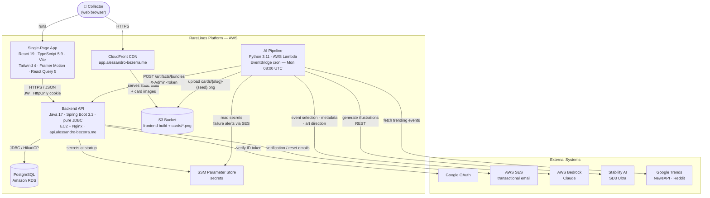
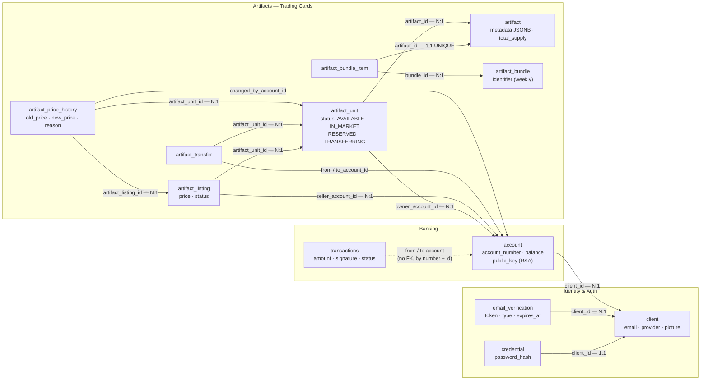

# 🃏 RareLines

**RareLines** is a premium digital trading card platform where every card is born from a real-world event. Each week, a fully automated AI pipeline scans trending news, selects the most compelling stories, writes card metadata with a dry, sharp editorial voice, art-directs and generates a unique illustration — and publishes the cards for collectors to claim, trade and collect.

**Live:** [app.alessandro-bezerra.me](https://app.alessandro-bezerra.me) · **API:** [api.alessandro-bezerra.me](https://api.alessandro-bezerra.me)

## 🚀 How It Works

```
Google Trends + NewsAPI + Reddit  →  multi-source news ingestion
↓  Claude (AWS Bedrock) selects the 10 most card-worthy events of the week
↓  Claude writes each card's metadata (name, rarity, attributes, abilities, lore…)
↓  Claude produces a structured art direction (cinematic moment → camera → light → medium)
↓  Python assembles the final image prompt — style is the last layer, never the first
↓  Stability AI SD3 Ultra renders the illustration
↓  Images land on S3 with immutable seed-based URLs
↓  Bundle is registered in the backend — cards become claimable and tradeable
```

The pipeline runs unattended every Monday at 08:00 UTC (AWS Lambda + EventBridge). Estimated AI cost: **~$0.65/week** for ~10 cards.

## 🏗️ Architecture — C4 Container Diagram (C2)



## 🗄️ Data Model — ER Diagram

Faithful to [`src/main/resources/schema.sql`](src/main/resources/schema.sql). An `artifact` is the card *type* (the print run); an `artifact_unit` is one physical copy a user actually owns, with its own ownership chain and price history.



## ✨ Features

- 🔐 **Authentication** — local (email + password with mandatory email verification) and Google OAuth; JWT delivered as an HttpOnly cookie
- 🔑 **RSA cryptography per account** — every transaction is signed with the account's 2048-bit private key and verified against the public key stored in the database
- 🃏 **Weekly AI-generated cards** — six rarity tiers (Common → Ultimate) with data-driven visual effects (foil, glow, shimmer, particles)
- 🎨 **Art Direction v2** — Claude reasons cinematically (moment → protagonist → camera → composition → light → medium) before a single prompt word is written; Python assembles the final prompt with style as the last layer
- 🖼️ **"Museum-label" card rendering** — full-bleed artwork with glassmorphism UI floating on top; overflow-proof by design (`line-clamp` everywhere)
- 🛒 **Marketplace** — public listings with search, price range, sorting and rarity filters; atomic status transitions eliminate race conditions
- 🎁 **Free claim with cooldown** — atomic supply decrement (`WHERE total_supply >= 1`), no overselling
- 📜 **Full provenance** — every unit carries its ownership chain and price history
- 👤 **Public profiles & user search** — read-only inventories, account lookup by name

## 🛠️ Tech Stack

| Layer | Technologies |
|---|---|
| **Backend** | Java 17 · Spring Boot 3.3 · pure JDBC (no ORM) · HikariCP · jjwt · BCrypt |
| **Frontend** | React 19 · TypeScript 5.9 · Vite · Tailwind CSS 4 · Framer Motion · React Query 5 · Recharts |
| **AI Pipeline** | Python 3.11 · AWS Bedrock (Claude) · Stability AI SD3 Ultra · pytrends · praw |
| **Database** | PostgreSQL (prod) · H2 in `MODE=PostgreSQL` (tests/local) |
| **Quality** | JUnit + JaCoCo (**90% line-coverage gate**) · Vitest + React Testing Library · ESLint · Spotless (google-java-format) · Husky hooks · commitlint (Conventional Commits) |
| **Infra** | EC2 · RDS · S3 · CloudFront · Route53 · Lambda · EventBridge · SES · SSM Parameter Store |
| **CI/CD** | GitHub Actions — push to `prod` deploys backend (SSH) and frontend (S3 sync + CloudFront invalidation) |

Estimated running cost: **~$27/month** infra + **~$2.60/month** AI generation.

## 💻 Running Locally

```bash
# Backend — H2 in-memory, emails logged to console, CORS open
mvn spring-boot:run -Dspring-boot.run.profiles=local

# Frontend — http://localhost:5173
cd frontend/assetstore && npm install && npm run dev

# Seed the local database with test data (backend must be running)
./seed-local.sh

# Backend tests (integration tests on H2, schema identical to prod)
mvn test

# Frontend tests (Vitest + React Testing Library) and lint
cd frontend/assetstore && npm run test && npm run lint

# Java formatting (Spotless + google-java-format) — check / auto-fix
mvn spotless:check
mvn spotless:apply

# Backend coverage report + 90% line-coverage gate (JaCoCo)
mvn test jacoco:report jacoco:check   # report: target/site/jacoco/index.html

# Frontend coverage report (no gate)
cd frontend/assetstore && npm run test:coverage

# Git hooks (Husky) — installed by npm install at the repo root
npm install
```

A Husky pre-commit hook runs the checks for whichever area the commit touches: Spotless + backend tests + the JaCoCo 90% coverage gate for Java changes, ESLint + Vitest for frontend changes. Docs-only commits skip everything. A commit-msg hook (commitlint) rejects messages that don't follow [Conventional Commits](https://www.conventionalcommits.org/).

## 🗺️ Roadmap

| Phase | Scope | Status |
|---|---|---|
| 1 | Domain refactor — `metadata JSONB` | ✅ Complete |
| 2 | AI pipeline — Bedrock + Stability, Lambda + EventBridge | ✅ Complete |
| 3 | Card rendering engine (2D) | 🔶 Partial — flip animation pending |
| 4 | Three.js — shaders, tilt, particles | ⏳ Planned |
| 5 | Booster packs — probability engine, pity system | ⏳ Planned |
| 6 | Marketplace analytics — price charts, volume | 🔶 Partial |
| 7 | Collections, achievements, profiles | 🔶 Partial |
| 8 | Full automation | 🔶 Partial — Lambda deploy still manual |

## 📄 License

This project is licensed under the MIT License.

You are free to use, modify, and distribute this project, as long as proper credit is given.

## 👨‍💻 Author

Developed by **Alessandro Bezerra**
